<div align="center">
  <h1> Memory-Vault</h1> 

  [](https://gradio.app)<br>
  <em>Whisper to future, Digital sticky notes, Learning machine</em>
</div>


Memory Vault is a Telegram bot that stores your notes and occasionally reminds them to you. It is the simplest and easiest learning/remembering machine. Think of it like Sticky Notes, but digital and much more simple. Never forget your notes!


1. Habit Building
2. Language Learning
3. Learning the way of Entrepreneurship
4. Remembering names
5. Notetaking
6. Or, Anything Custom, Memory Vault is very flexible and general solution!


<br>

<font size="1"> (I'm just an engineer, without any design skills :D)</font> 

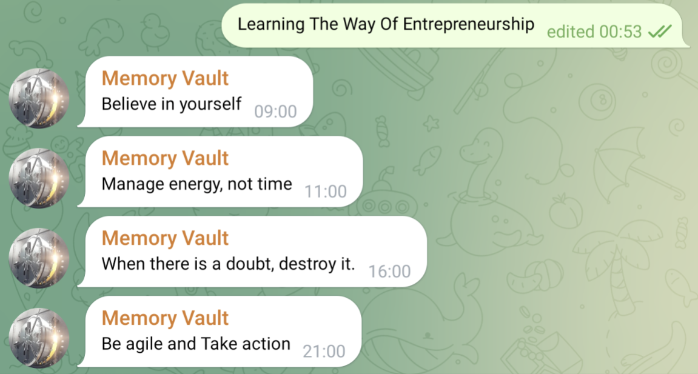

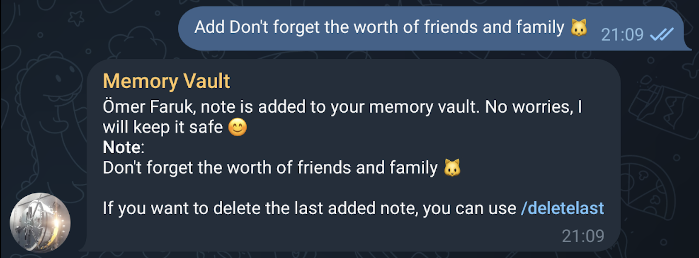


# Start
Hello Ömer Faruk 👋🏻

Keeping note of beautiful & important stuff that we come across throughout the life, and later remembering them is quite difficult isn't it 😔? Here is the Memory Vault for the rescue! Just take your notes, and I will occasionally remind them to you 😎

Unfortunately in this era our days&agendas are very busy and it is very hard to follow something consistently. Memory Vault helps us on this front by continuously reminding our notes to us so that you won't ever forget them. You can use it for


❤️ Sincerely thanks to my dear wife Seyyide for the beautiful idea.


## Use Cases
1. Habit Building 
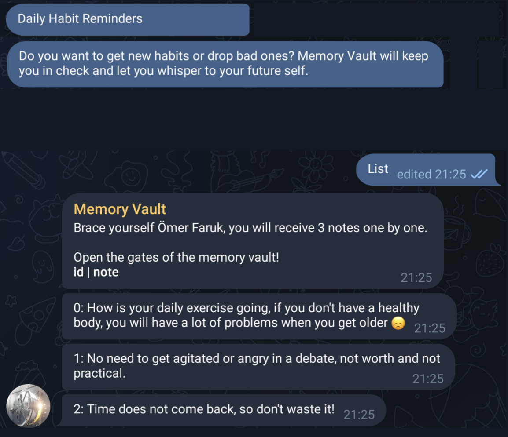
2. Language Learning
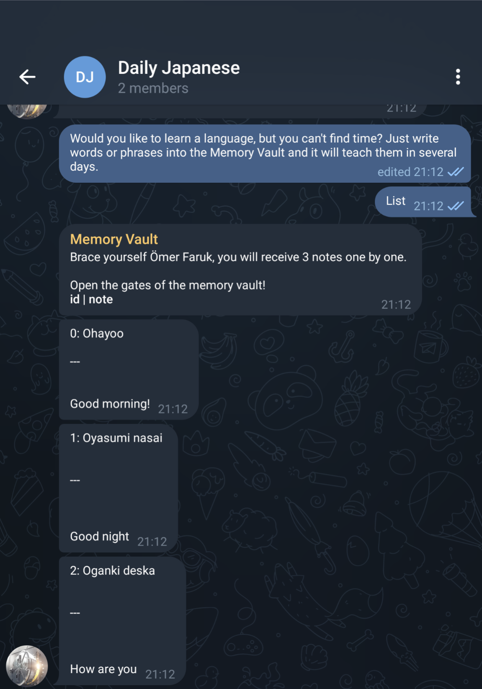
3. Developing Enterprenurship Vision
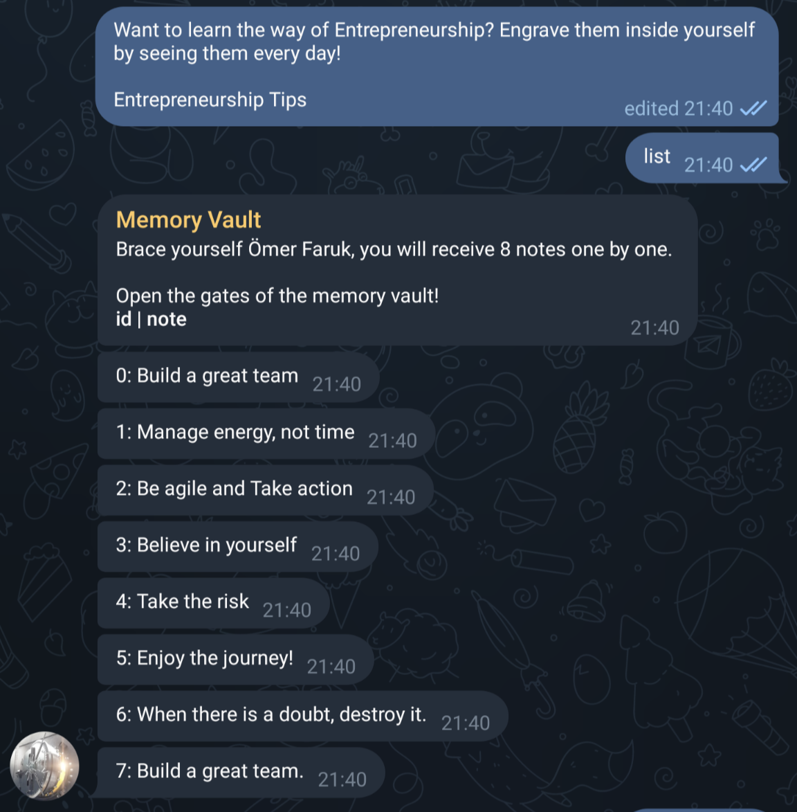
4. Learning new names
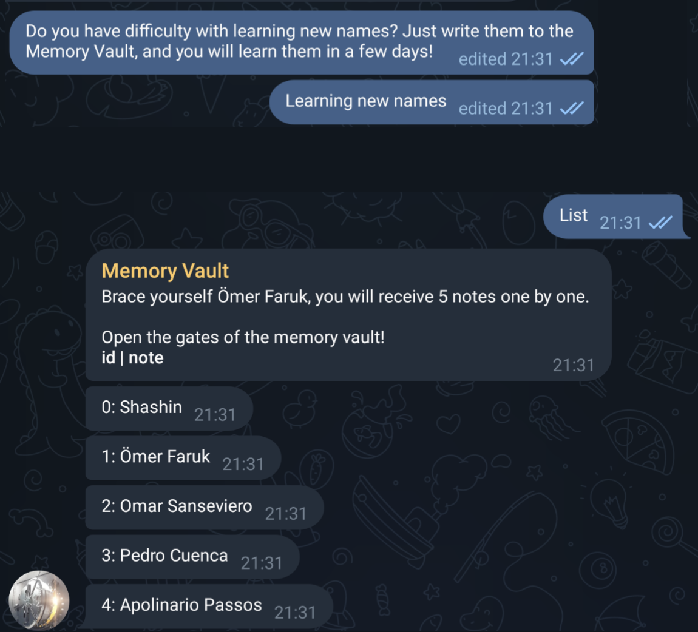
5. Anything Custom, Memory Vault is very flexible and general solution!

## [Try it from here!](https://t.me/Memory_Vault_Bot)

## Tutorials
1. 
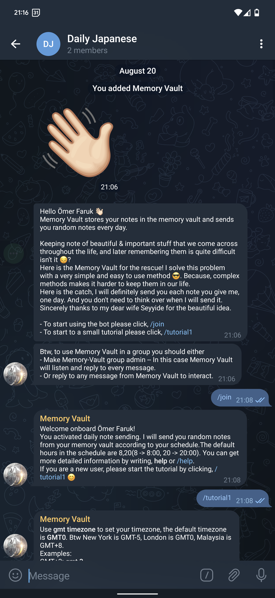

2. 

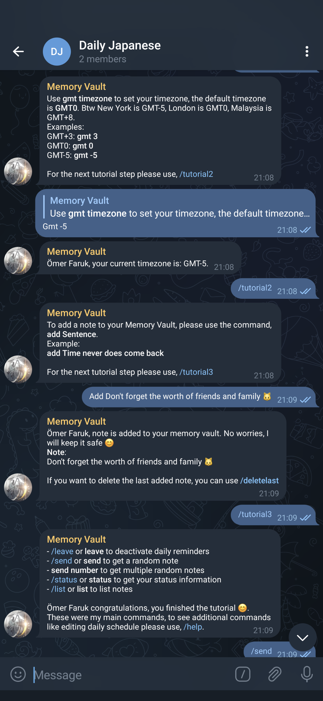

3.

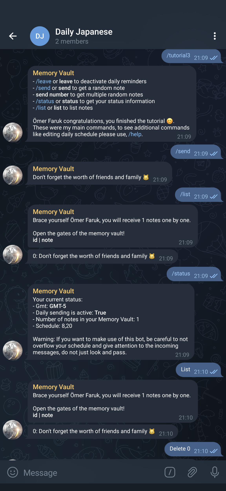

4. 
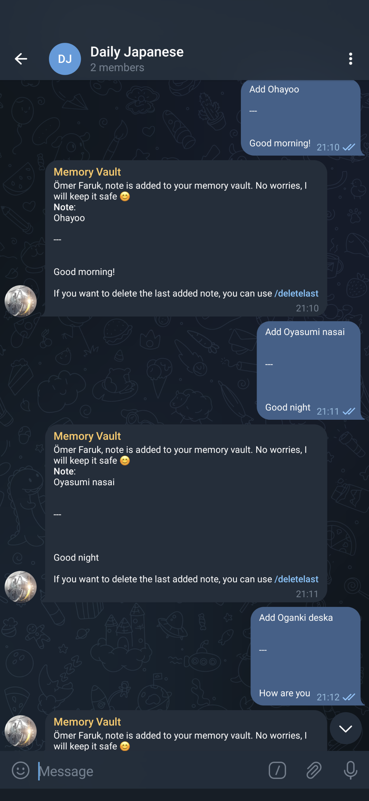

5.
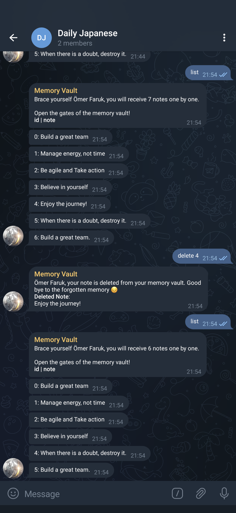

6.
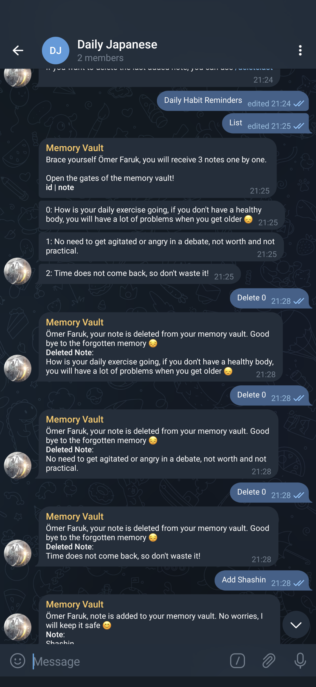

7.
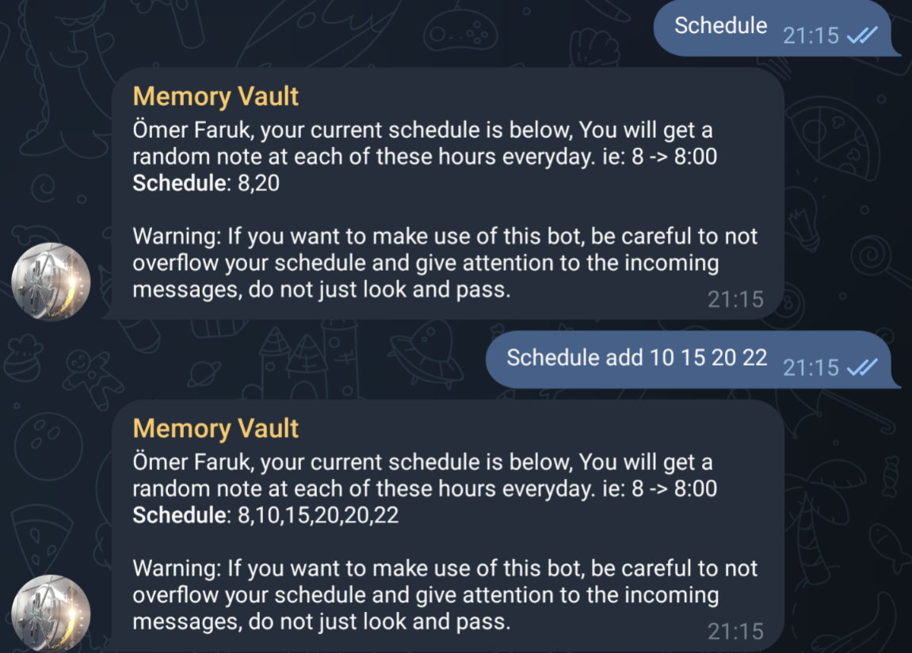

8.
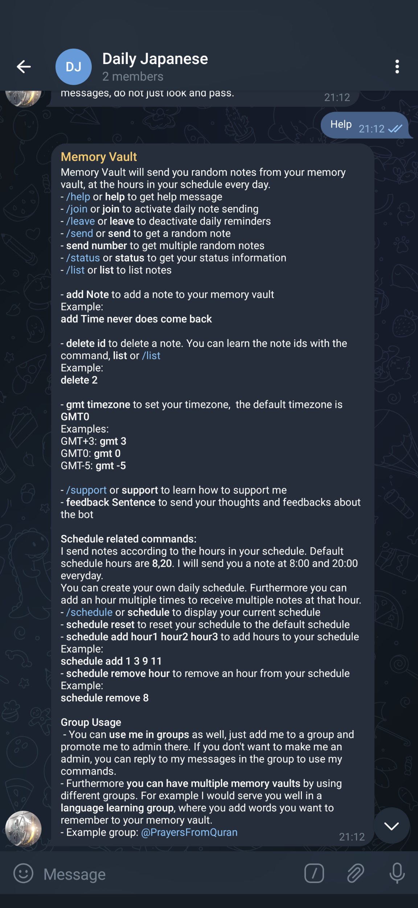


## Requirements

- sqlite
- requirements

```
pip3 install -r requirements.txt
```

## Run With Ngrok

Run without timeout limit:

```
export NGROK_AUTH_TOKEN={TOKEN} 
export TELEGRAM_TOKEN={TOKEN} 
python3 -m src.__init__ ngrok
```

Run with timeout limit:

```
export TELEGRAM_TOKEN={TOKEN} 
python3 -m src.__init__ ngrok
```

## Run With Public IP

Run with self-signed ssl certificate

```
export TELEGRAM_TOKEN={TOKEN} 
python3 -m src.__init__ self-signed
```

Run with authority-signed ssl certificate

```
export TELEGRAM_TOKEN={TOKEN} 
python3 -m src.__init__
```


