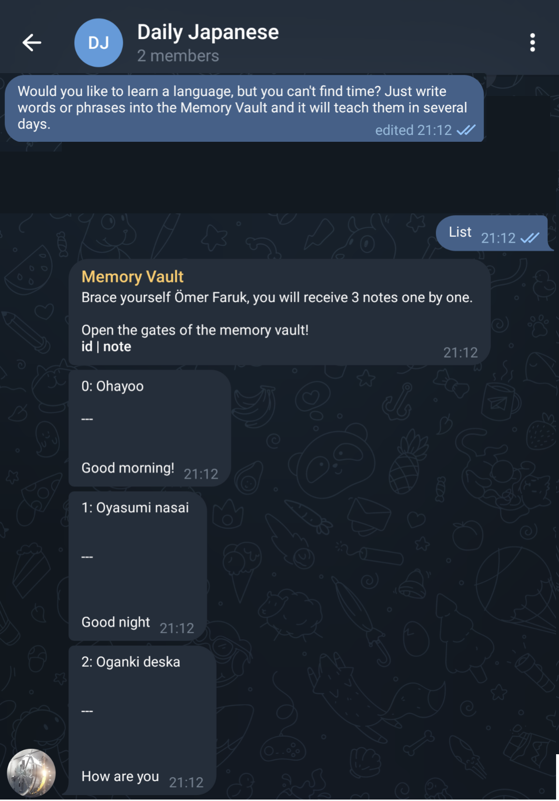
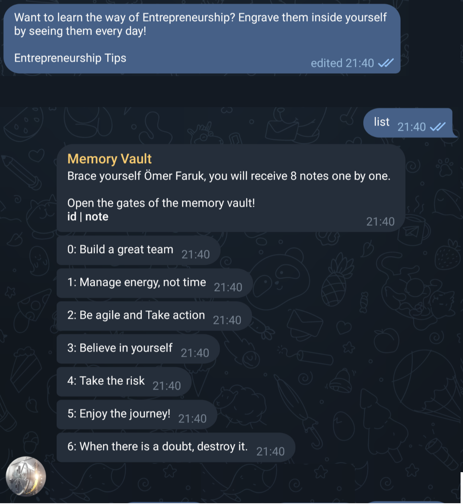

<div align="center">
  <h1> Memory-Vault</h1> 
  <em> Click on the image to try it</em> 

  [](http://t.me/memory_vault_bot)<br>
  <em>Whisper to future, Digital sticky notes, Learning machine</em>
</div>


Memory Vault is a Telegram bot that you can store your notes, and get reminded random notes, everyday. It is the simplest and easiest learning/remembering machine. Think of it like Digital Sticky Notes, but much more simple. Never forget your notes!

<br>


<div align="center">
<br>
<em>(Just an engineer, without any design skills :D)</em>
</div>

**Use Cases**

1. Habit Building
2. Language Learning
3. Learning the way of Entrepreneurship
4. Remembering names
5. Notetaking
6. Or, Anything Custom, Memory Vault is very flexible and general solution!


# Contents

[0. Intro](#-memory-vault)

[1. Start](#start)

[2. Use Cases](#use-cases)

[3. Tutorials](#tutorials)

[4. Software Information](#software-information)


# Start
Hello Ömer Faruk 👋🏻

Keeping note of beautiful & important stuff that we come across throughout the life, and later remembering them is quite difficult isn't it 😔? Here is the Memory Vault for the rescue! Just take your notes, and I will randomly remind them everyday 😎

Unfortunately in this era our days&agendas are very busy and it is very hard to follow something consistently. Memory Vault helps us on this front by continuously reminding our notes daily, so that we won't ever forget them. 

❤️ Sincerely thanks to my dear wife Seyyide for the beautiful idea.


You can use it for

## Use Cases
1. Habit Building 

2. Language Learning

3. Developing Enterprenurship Vision

4. Learning new names

5. Anything Custom, Memory Vault is very flexible and general solution!

## [Try it from here!](https://t.me/Memory_Vault_Bot)

## Tutorials
1. 


2. 


3.


4. 


5.


6.


7.


8.


# Software Information


## Requirements

- sqlite
- requirements

```
pip3 install -r requirements.txt
```

## Run With Ngrok

Run without timeout limit:

```
export NGROK_AUTH_TOKEN={TOKEN} 
export TELEGRAM_TOKEN={TOKEN} 
python3 -m src.__init__ ngrok
```

Run with timeout limit:

```
export TELEGRAM_TOKEN={TOKEN} 
python3 -m src.__init__ ngrok
```

## Run With Public IP

Run with self-signed ssl certificate

```
export TELEGRAM_TOKEN={TOKEN} 
python3 -m src.__init__ self-signed
```

Run with authority-signed ssl certificate

```
export TELEGRAM_TOKEN={TOKEN} 
python3 -m src.__init__
```


